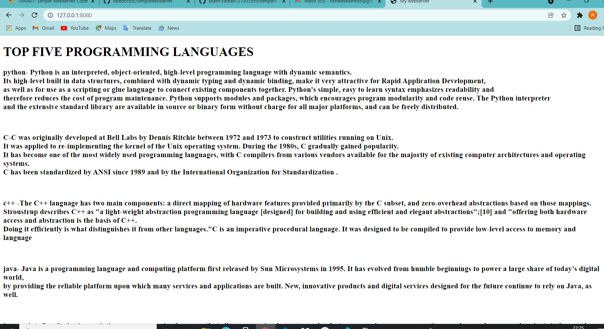
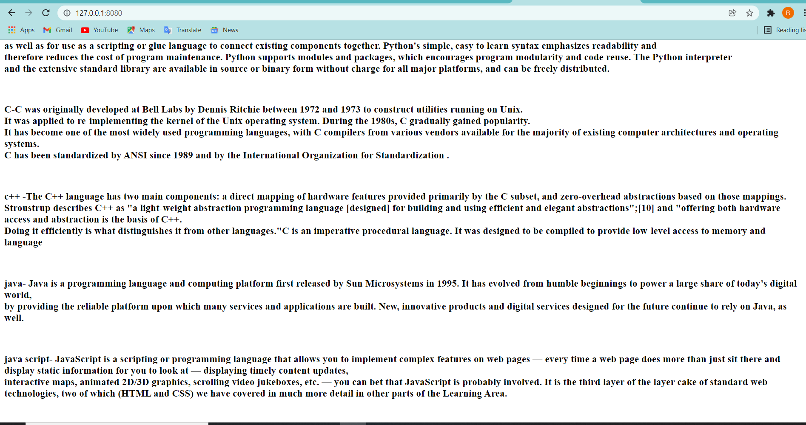
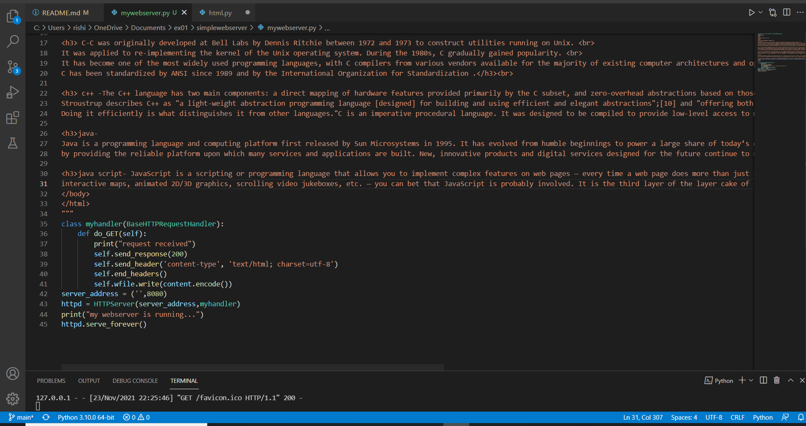

# Developing a Simple Webserver
## AIM:
To develop a simple webserver to display about top five programming languages.

## DESIGN STEPS:
### Step 1: 
HTML content creation
### Step 2:
Design of webserver workflow
### Step 3:
Implementation using Python code
### Step 4:
Serving the HTML pages.
### Step 5:
Testing the webserver

## PROGRAM=
```
from http.server import HTTPServer, BaseHTTPRequestHandler
content = """/
<!DOCTYPE html>
<html>
<head>
<title>My webserver</title>
</head>
<body>
<h1>TOP FIVE PROGRAMMING LANGUAGES</h1>
<h3> python- 
Python is an interpreted, object-oriented, high-level programming language with dynamic semantics.<br>
Its high-level built in data structures, combined with dynamic typing and dynamic binding, make it very attractive for Rapid Application Development, <br>
as well as for use as a scripting or glue language to connect existing components together. Python's simple, easy to learn syntax emphasizes readability and <br>
therefore reduces the cost of program maintenance. Python supports modules and packages, which encourages program modularity and code reuse. The Python interpreter <br>
and the extensive standard library are available in source or binary form without charge for all major platforms, and can be freely distributed. </h3><br>

<h3> C-C was originally developed at Bell Labs by Dennis Ritchie between 1972 and 1973 to construct utilities running on Unix. <br>
It was applied to re-implementing the kernel of the Unix operating system. During the 1980s, C gradually gained popularity. <br>
It has become one of the most widely used programming languages, with C compilers from various vendors available for the majority of existing computer architectures and operating systems.<br>
C has been standardized by ANSI since 1989 and by the International Organization for Standardization .</h3><br>

<h3> c++ -The C++ language has two main components: a direct mapping of hardware features provided primarily by the C subset, and zero-overhead abstractions based on those mappings.<br>
Stroustrup describes C++ as "a light-weight abstraction programming language [designed] for building and using efficient and elegant abstractions";[10] and "offering both hardware access and abstraction is the basis of C++.<br>
Doing it efficiently is what distinguishes it from other languages."C is an imperative procedural language. It was designed to be compiled to provide low-level access to memory and language </h3><br>

<h3>java- 
Java is a programming language and computing platform first released by Sun Microsystems in 1995. It has evolved from humble beginnings to power a large share of today’s digital world,<br>
by providing the reliable platform upon which many services and applications are built. New, innovative products and digital services designed for the future continue to rely on Java, as well.</h3><br>

<h3>java script- JavaScript is a scripting or programming language that allows you to implement complex features on web pages — every time a web page does more than just sit there and display static information for you to look at — displaying timely content updates,<br>
interactive maps, animated 2D/3D graphics, scrolling video jukeboxes, etc. — you can bet that JavaScript is probably involved. It is the third layer of the layer cake of standard web technologies, two of which (HTML and CSS) we have covered in much more detail in other parts of the Learning Area.</h3><br>
</body>
</html>
"""
class myhandler(BaseHTTPRequestHandler):
    def do_GET(self):
        print("request received")
        self.send_response(200)
        self.send_header('content-type', 'text/html; charset=utf-8')
        self.end_headers()
        self.wfile.write(content.encode())
server_address = ('',8080)
httpd = HTTPServer(server_address,myhandler)
print("my webserver is running...")
httpd.serve_forever()
```
## OUTPUT:








## RESULT:
To obtained top five programming languages.
